# 🏏 ODI Cricket Data Analysis (1975–2023)

This project analyzes how ODI cricket has evolved across World Cups from 1975 to 2023 using data analysis and visualization.

The goal is to uncover trends in scoring, batting behavior, match dynamics, and the key factors driving modern aggressive cricket.

---

## 📊 Key Insights

- Run rate increased from **3.27 → 6.8 RPO**
- Average scores grew from **~200 → 340+**
- Six hitting increased from **~2 → 12+ per match**
- Strong relationship between sixes and run rate (**r ≈ 0.89**)
- Post-2003 era shows aggressive shift (T20 influence)
- Toss has **no significant impact** on match outcomes

---

## 📁 Dataset

- `matches.csv`
- `tournaments.csv`

---

## 📈 Analysis Includes

- Run rate trends over time  
- Score distribution analysis  
- Toss impact analysis  
- Correlation & regression  
- Era-wise comparison  
- Match margin analysis  
- Team performance analysis  
- 2027 World Cup prediction  

---

## 🛠 Tech Stack

- Python  
- Pandas  
- Matplotlib  
- Seaborn  

---

## 📸 Sample Visuals

### 📈 Run Rate Growth
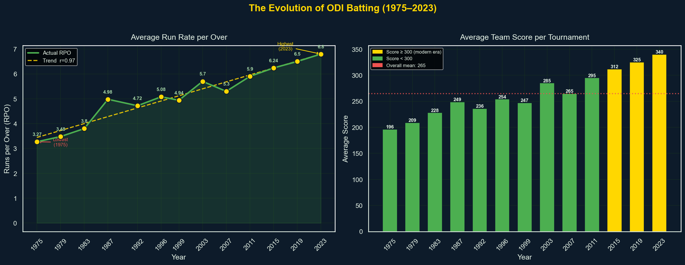

---

### 💥 Boundary Revolution
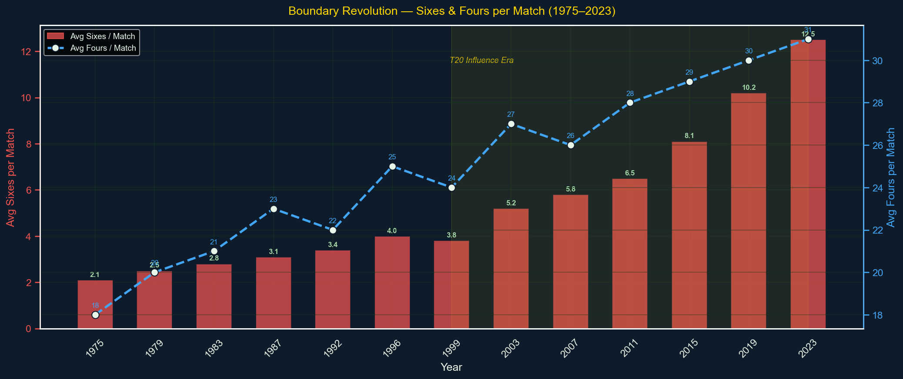

---

### 🔗 Correlation Analysis
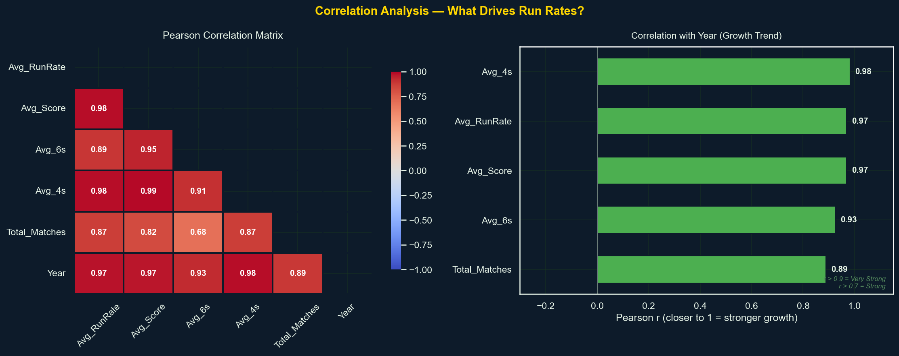

---

### 📊 Score Distribution
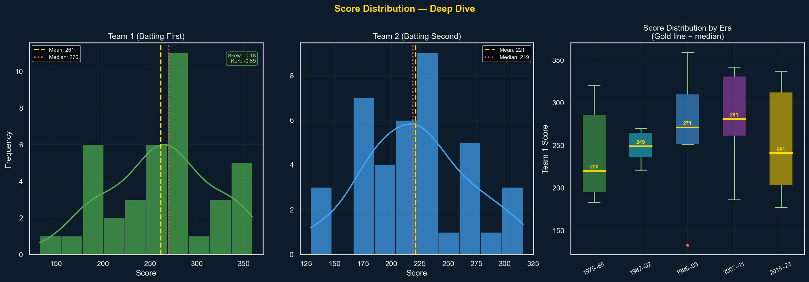

---

### 🏆 Championship Analysis
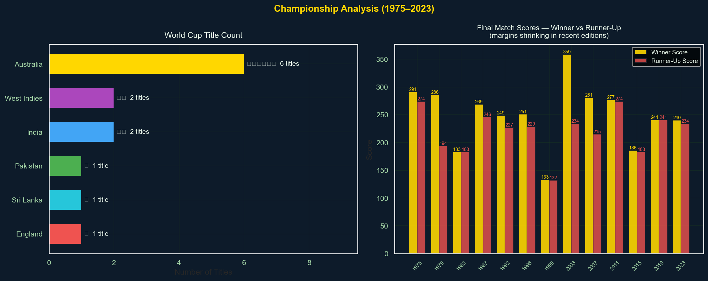

---

### 🎯 Toss Impact
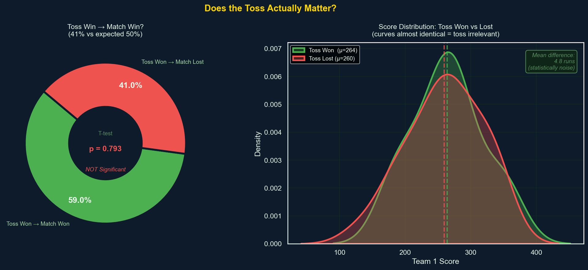

---

### 📉 Regression Analysis
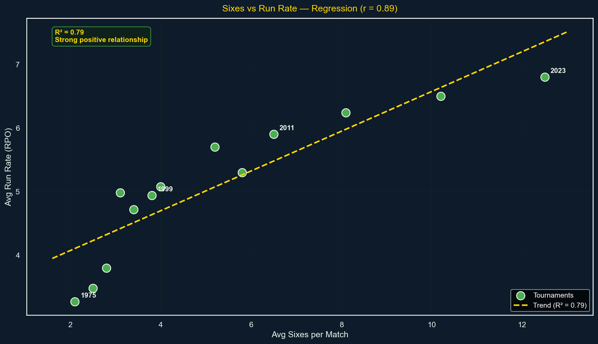

---

### 📏 Match Margins
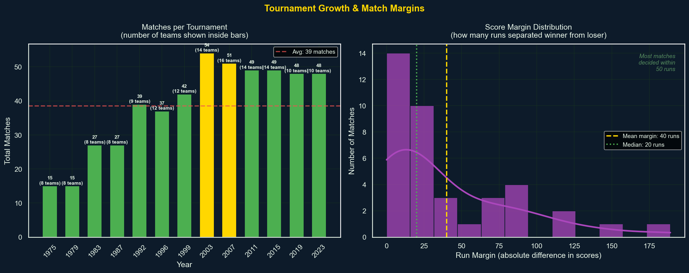

---

### 🔮 2027 Prediction
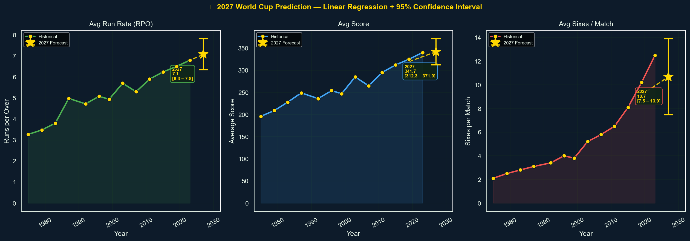

---

### 📊 Team Performance
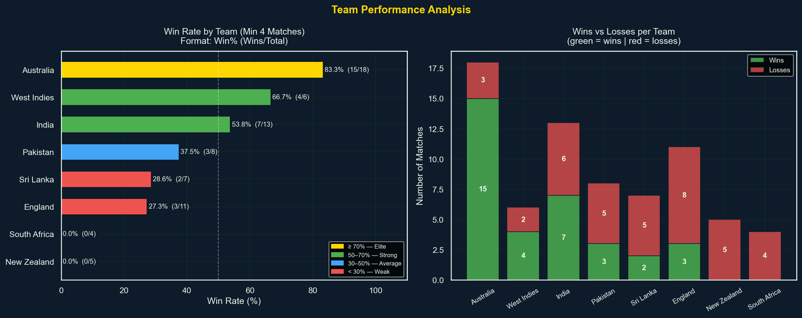

---

### 📅 Era Evolution
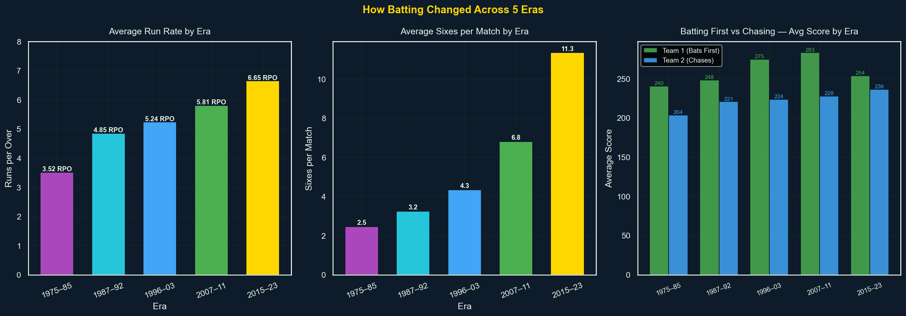

---

### ⚙️ Format Comparison
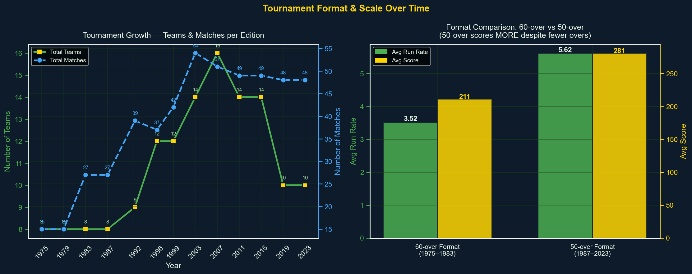

---

## 🔗 Author

**Shivam Kumar Singh**  
GitHub: https://github.com/shivam-rajput301

---

## ⭐ If you like this project, give it a star!
